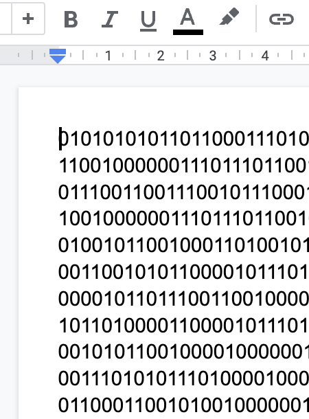
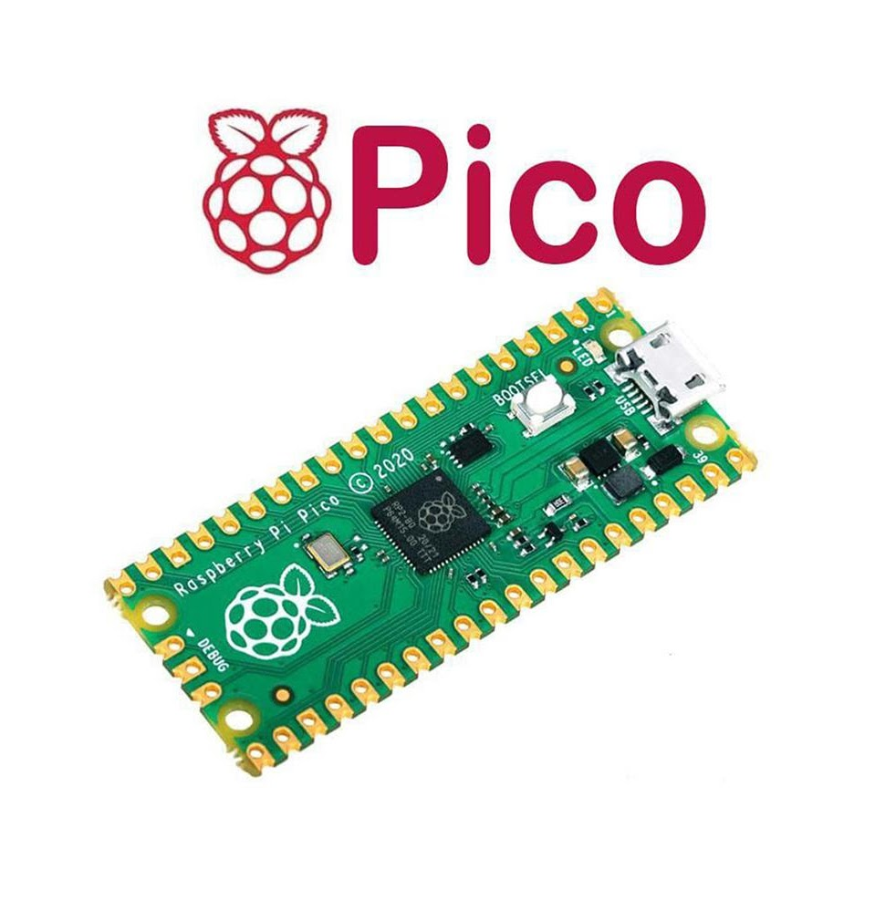
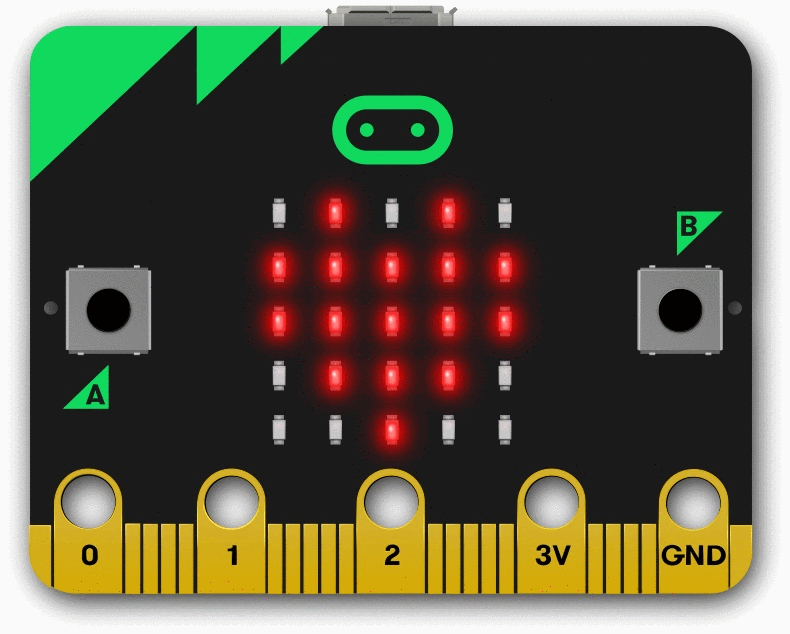
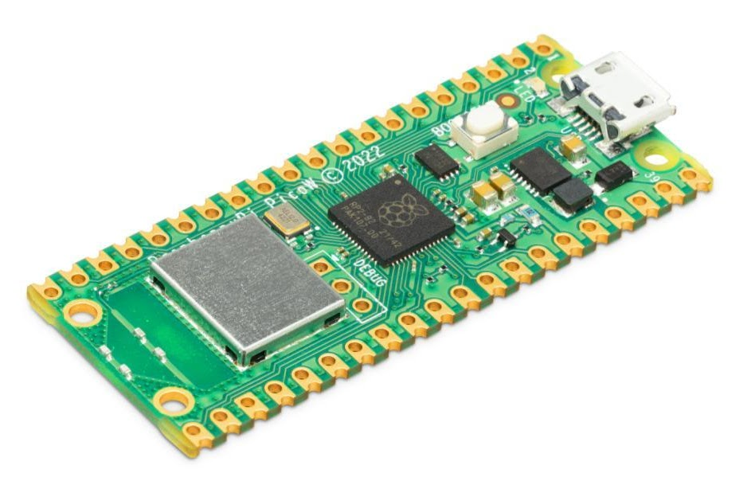
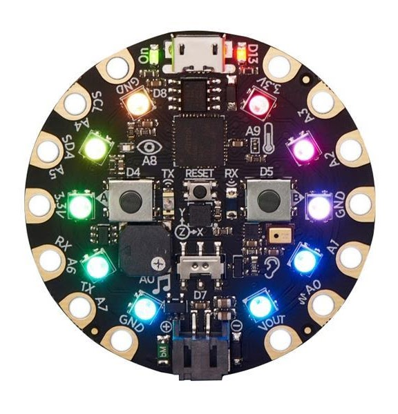
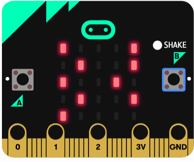

# Unit 2: Managing State

## 1 Binary Secret Code - Introduction to Abstraction

### 1-1 Binary Secret Code - Introduction to Abstraction

We are moving on to Standard 6 which is about levels of abstraction. To understand what is meant by that, we're starting with a secret message in binary code

- [Binary code](https://docs.google.com/document/d/1kezu8lGU67GcGHCYDIvUUrRqeUwTgyaD42zFfC4XZ_0/edit?usp=sharing) as a text file

In this video, Mr. Weinberg introduces the idea of abstraction and teaches you to use Python to decrypt this binary code.

- [YouTube Video](https://www.youtube.com/watch?v=4GWgFZCZn94) 20:39

[Link to starter code](https://www.google.com/url?q=https%3A%2F%2Freplit.com%2F%40evanweinberg%2FTranslatingBinary%23main.py&sa=D&sntz=1&usg=AOvVaw3w90p6AB7BNC23sKSMMrLL) in Replit

## 2 Three Boards, Three Flavors

### 2-1 Abstraction vs. Problem Decomposition

Discussion forum on Schoology

- [Link to Assignment](https://docs.google.com/document/d/1tk-gJRYXZB_IMt6jK14gWcaT7Nja70v3mpi6DMMQfak/edit?usp=sharing)

### 2-2 Three Boards, Three Flavors

Watch this short video intro to our case study for today. It shows three different microcontroller boards running three different programs that achieve the same overall goal.

- [YouTube Video](https://www.youtube.com/watch?v=_zupBo2glAk) 1:42

### 2-3 Case Study Three Boards - Google Doc

Make a copy of this Google Document to fill out with your group members as you look into the video and explore the code.

- [Case Study template](https://docs.google.com/document/d/1nADy817iVK_Uais-4eWhLqNB3-nc6toHfbmavBr7VHU/edit)

Some microcomputers we used to build and program a state machine. Here for "Three Boards, Three Flavors".

## 3 Introduction to State Machine Programming - Escape to Summer Case Study

### 3-1 Introduction to State Machine Programming

Based on what you did last time analyzing the code of a microcontroller board and accelerometer, this video introduces how the concept of a state machine makes this code more modular and easier to debug. The idea is to refactor the code that deals with inputs, outputs, and the logic into separate functions. This abstraction makes it easier to build more complex programs than you might otherwise be able to program.

- [YouTube Video](https://youtu.be/FPyg7os2Cbw) (7:35)

## W5-3 Binary Secret Code - Introduction to Abstraction

[Binary code](https://docs.google.com/document/d/1kezu8lGU67GcGHCYDIvUUrRqeUwTgyaD42zFfC4XZ_0/edit) or here at github [code.txt](binary/code.txt)

[Starter code on Replit](https://replit.com/@evanweinberg/TranslatingBinary#main.py)

## W6-5 Second module
